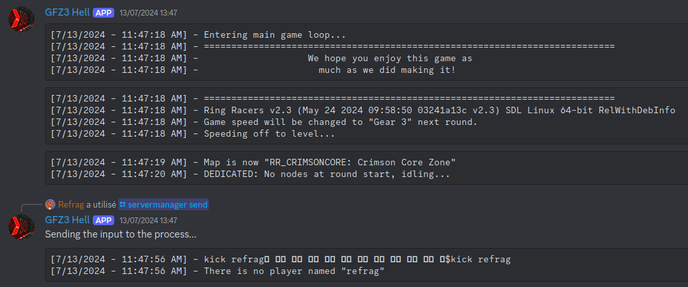
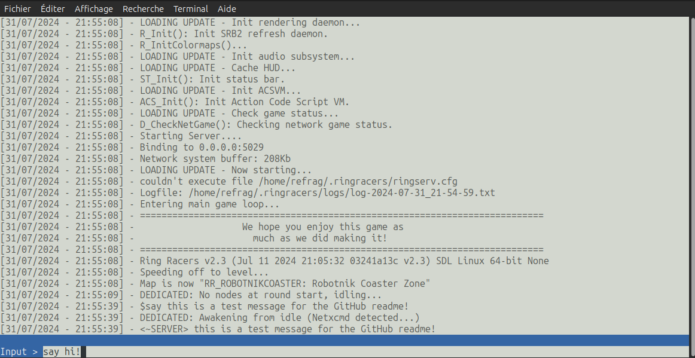
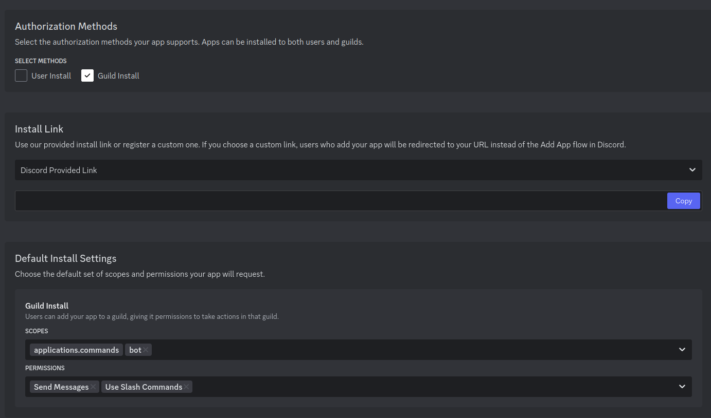

# ServerManagerBot

A wrapper around a server that output server logs and provides interaction through Discord and / or a dedicated TUI: the server shell.

|      Discord       |    Server shell    |
|:------------------:|:------------------:|
||    |

# Build

Before building, make sure you have the [.NET 6 SDK](https://dotnet.microsoft.com/en-us/download/dotnet/6.0) installed.

- Clone the repository: `git clone https://github.com/Refragg/ServerManagerBot`
- Change directory into the repository's project: `cd ServerManagerBot/ServerManagerBot`
- Build the project: `dotnet publish -c Release --self-contained -p:PublishSingleFile=True` (you can also use --no-self-contained if the target has the .NET 6 runtime installed)
- The binary should be available in `bin/Release/(target-os)/publish/`

# How to use

## Discord bot setup

- Head over to [the Discord developer portal](https://discord.com/developers/)
- Create or use an existing application
- Grab and copy the bot token: go to the 'Bot' tab and hit 'Reset Token'

- Setup the invitation for your bot


- Copy the install link, open it and follow the steps to invite your bot to your Discord server

- Make sure that your bot has access to the Discord channels it should log into with sufficient permissions

## Configuration and environment variables

You will first need to create a file named `discord-conf.json` in the folder where the ServerManagerBot executable is.
You can also override the path to this configuration file by setting the `ServerManagerBot_ConfPath` environment variable.

This file should contain the following contents:

```
{
  // These represent the Discord channels where your bot will log the messages
  "LogChannelsIds": [ 1234567890123456789, 2345678901234567890 ],

  "Token": "Your Discord bot token",
  "LogStarter": "The Discord logging will start only after this message has been seen, leave blank if not needed",
  "IgnoredLogs": [
    "This message will not be logged on Discord!",
    "It will still appear in the server shell though"
  ]
}
```

Optionally, you can add simple custom commands by configuring them through the `commands-conf.json` file.
You can still override the path to this configuration file by setting the `ServerManagerBot_CommandsConfPath` environment variable.

If you want to use custom commands, this file should contain the following contents:

```
{
  // Measured in seconds, this is a global cooldown period so that users have to wait X seconds before using a command again
  "Cooldown": 10,

  // This regex filters to the start of the command itself The regex should match everything that's before the actual command, it will take whatever is on the right of this regex
  // Example: this regex below will work on messages of this type: '<username> !dostuff'. it will only take the !dostuff part.
  "CommandStartRegex": "^<.+> ",

  "Commands": {
    "!dostuff": "echo 'this will be sent back to the running process when !dostuff is received!'",
    "!ping": "echo 'pong!'"
  }
}
```

Lastly, there are 2 more environment variables that you can set:

- ServerManagerBot_UsePty: Set this to either 1, 'yes' or 'true' so that ServerManagerBot starts the server process inside a pseudo-terminal. Some servers may require this in order to work properly. This has only been tested on Linux and can be quite finicky.
- ServerManagerBot_ManagementPort: If set to any number between 1 and 65535, a localhost only HTTP listener will be started on that port, you can then send input to the server process by sending a POST request to `http://localhost:(port number)/send` with the raw command in the request's body. This can be useful for automation, here's a simple example using curl: `curl http://localhost:5000/send -d "echo this is a message from the HTTP management interface!"`

## Usage

Once you've created the configuration files and read about the environment variables, you can proceed to start the ServerManagerBot using this syntax:

`./ServerManagerBot "path/to/server/executable" "path/to/working/dir" (whitespace separated server arguments)`

If it works correctly, you should have the server shell where you can scroll and send commands to your process. The Discord logging will then start.

## Additional notes

- The Discord logging is buffered to avoid sending too many messages: once a message has been received, the ServerManagerBot will wait 7 seconds to collect more messages. After these 7 seconds elapsed, the messages will be flushed and logged to the configured Discord channels.
- When using the server shell, you can use special commands to control the interface / server:
    - @pause: This toggles pausing the logging inside the server shell. This can be useful if you wanna scroll back up to read previous logs
    - @quit: This shuts down and quits the ServerManagerBot
    - @start (unusable at the moment): This starts the process back after it exited
    - @stop: This stops the server process (at the moment, it also calls @quit which will quit the ServerManagerBot)
- When using Discord, you will be able to control the ServerManagerBot by using the send, quit and stop Slash Commands which will behave similarly as the commands from the server shell

If you've made it this far, thnak you for your attention, this project could use some polishing and some fixes but i've somewhat tailored it to my specific use case so some things could be generalized more, maybe in the future!